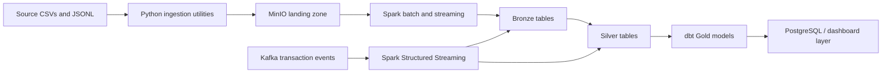

# Banking Transaction Lakehouse and Fraud Monitoring Platform

Local end-to-end lakehouse platform for the Batch 14 final capstone briefing. The project is designed for a fictional regional digital bank that needs controlled ingestion, lakehouse storage, operational orchestration, analytical modelling, and foundation components for fraud monitoring and pipeline observability.

The current repository focuses on the lakehouse foundation:

- MinIO object storage for local landing and lakehouse zones.
- Airflow orchestration for ingestion tasks.
- Reference data ingestion into MinIO.
- Delta Lake table writes for local analytical storage.
- Standalone Spark for MinIO-backed batch and SQL model processing.
- Docker Compose-based local development.

## Business Context

The bank receives historical CSV snapshots, customer and account master data, daily balances, settlement files, and near-real-time transaction events. The target platform supports:

- Transaction analytics by branch, channel, and transaction type.
- Settlement reconciliation and variance tracking.
- Basic fraud and anomaly monitoring.
- Data quality gates and pipeline health checks.
- Business-facing dashboards for operations, finance, and risk.

## Target Architecture



Suggested storage layout in MinIO:

```text
landing/source=<source_name>/ingestion_date=YYYY-MM-DD/
bronze/<table_name>/
silver/<table_name>/
gold/<table_name>/
```

## Technology Stack

- Python for ingestion utilities, validation helpers, and synthetic data generation.
- PostgreSQL for serving, audits, and dashboard support.
- Kafka for transaction event streaming and DLQ handling.
- Spark standalone cluster for batch and streaming processing plus dbt Spark SQL models.
- Airflow for orchestration.
- dbt Core for staging, marts, tests, and documentation.
- MinIO for local object storage.
- Delta Lake for open table format storage.
- Docker Compose for local startup and service wiring.

## Repository Layout

```text
docker-compose.yml   Local service orchestration
Dockerfile           Airflow image build
dags/                Airflow DAGs
data/                Source and sample datasets
dbt/                dbt project and profiles
logs/               Local logs
plugins/            Airflow plugins
sql/                Database initialization SQL
src/                Python ingestion and utility scripts
```

## Data Sets

The repository includes the reference and sample data used by the capstone.

| Dataset                                     | Type      | Purpose                                       |
| ------------------------------------------- | --------- | --------------------------------------------- |
| `data/reference/branches.csv`               | Reference | Branch dimension and regional reporting       |
| `data/reference/transaction_types.csv`      | Reference | Transaction type dimension                    |
| `data/reference/merchant_categories.csv`    | Reference | Merchant category dimension and risk analysis |
| `data/batch/accounts/`                      | Batch     | Account snapshots                             |
| `data/batch/balances/`                      | Batch     | Daily balance snapshots                       |
| `data/batch/customers/`                     | Batch     | Customer snapshots                            |
| `data/batch/settlements/`                   | Batch     | Settlement inputs                             |
| `data/batch/transactions/`                  | Batch     | Historical transaction extracts               |
| `data/streaming/transaction_events_*.jsonl` | Streaming | Kafka-style transaction event source          |
| `data/streaming/malformed_events_*.jsonl`   | Streaming | Invalid event samples for DLQ testing         |

## Current Pipelines

### Reference ingestion

The project includes a Python utility in `src/reference_minio_loader.py` and an Airflow DAG in `dags/reference_dag.py` that loads the reference CSV files from `data/reference/` into MinIO and writes Delta Lake tables for downstream processing.

### Airflow foundation

Two starter DAGs are present:

- `dags/test_dag.py` demonstrates the basic Airflow decorator pattern.
- `dags/reference_dag.py` orchestrates reference data loading.

The container stack mounts `./dags` to `/opt/airflow/dags`, so Airflow reads DAGs from the repository root `dags/` directory.

## Required Capstone Coverage

This project brief expects the following end state:

- At least three batch sources: customers, accounts, and transactions.
- At least one settlement or balance source for reconciliation or snapshot modelling.
- At least two Kafka topics: raw transactions and DLQ.
- At least three Airflow DAGs: ingestion, processing, and dbt/quality/dashboard.
- Landing, Bronze, Silver, and Gold layers.
- At least two fact tables and five dimensions.
- At least ten meaningful data-quality checks.
- At least two dashboard pages: business metrics and pipeline health.
- A documented Docker Compose setup.
- README, architecture diagram, data dictionary, runbook, and final demo script.

## Recommended Dimensional Model

The capstone design targets the following analytical tables:

- `fact_transaction`
- `fact_daily_account_balance`
- `fact_settlement_reconciliation`
- `fact_fraud_alert` optional
- `dim_customer`
- `dim_account`
- `dim_branch`
- `dim_channel`
- `dim_transaction_type`
- `dim_date`

## Local Services & Exposed Ports

The Docker Compose stack exposes the following services and ports locally:

- **MinIO API:** `http://localhost:9000`
- **MinIO Console:** `http://localhost:9001` (Credentials: `minioadmin` / `minioadmin123`)
- **Spark Thrift Server (JDBC/ODBC):** `localhost:10000` (for dbt Spark SQL models)
- **Spark UI:** `http://localhost:4040` (Available when Thrift server or Spark jobs are running)
- **Jupyter Notebook:** `http://localhost:8888` (Token: `minioadmin`)
- **Airflow Webserver:** `http://localhost:8080` (Credentials: `airflow` / `airflow`)
- **ETL PostgreSQL:** `localhost:5433` (Serving layer database)
- **Airflow PostgreSQL:** internal only (metadata)

## Setup

### 1. Build the image

```bash
docker compose build --no-cache
```

### 2. Start the stack

```bash
docker compose up -d
```

### 3. Initialize Airflow

The `airflow-init` service creates the Airflow metadata schema and the admin user during first startup.

### 4. Open the UIs

- **Airflow:** `http://localhost:8080`
- **Jupyter Notebook:** `http://localhost:8888`
- **MinIO console:** `http://localhost:9001`

## Airflow Connection

The stack provides an Airflow connection for MinIO named `minio`. The reference loader uses that connection through Airflow's S3 hook path so the containerized runtime can talk to MinIO without hardcoding local-only credentials in task code.

Spark is configured with S3A access to MinIO and Delta Lake support through `spark-defaults.conf`. dbt points at the Spark Thrift Server, so future models can be written as Spark SQL models against the lakehouse tables stored in MinIO.

## Data Flow

1. Reference CSVs are copied to MinIO as raw landing files.
2. The same run also writes Delta Lake tables for downstream analytics.
3. Airflow coordinates the ingestion step.
4. Future DAGs can extend the same pattern for batch snapshots, streaming ingestion, dbt runs, and quality gates.

## Environment Variables

Useful variables exposed through Compose:

- `MINIO_ROOT_USER`
- `MINIO_ROOT_PASSWORD`
- `MINIO_ENDPOINT`
- `MINIO_BUCKET`
- `MINIO_REFERENCE_PREFIX`
- `MINIO_REGION`
- `MINIO_AWS_CONN_ID`
- `SPARK_MASTER_URL`
- `SPARK_THRIFTSERVER_HOST`
- `SPARK_THRIFTSERVER_PORT`
- `SPARK_WAREHOUSE_DIR`

## Suggested Next Build-Out

- Add batch ingestion DAGs for customers, accounts, transactions, balances, and settlements.
- Add Spark jobs for Bronze and Silver processing.
- Add dbt models, tests, and documentation for Gold marts.
- Add Kafka topics and streaming replay jobs for transaction events and DLQ handling.
- Add a dashboard layer for business and operational reporting.

## Notes

This repository is structured as a production-like local learning environment. The goal is to demonstrate architecture decisions, operational controls, and data modelling choices, not only raw ETL movement.
